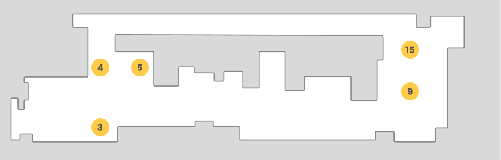

# Mobile Robotics Anomaly Detection

In this project, we introduce a way to manage a dataset of time series, with the goal of perform offline anomaly detection on a mobile robot.

The code is able to process a time series dataset by easily applying pre-processing operations, several anomaly detection algorithms (PCA, NN, SVM, etc) and several threshold identification methods (quantile, one class svm, etc).
But, the code is not limited to these methods, it's possible to add new methods and apply them to the dataset.

The code is structured in a way such that online anomaly detection can be easily performed, once an real-time source of data is provided.

The dataset is composed of 10 time series with anomalies, and 7 nominal without anomalies.

The waypoints specific point located in the ICE lab as shown in the following figure.




| Filename   | Waypoints          | Comment                                             |
| ---------- | ------------------ | --------------------------------------------------- |
| 01_nominal | 5 - 4 - 15 - 4     | Nominal                                             |
| 02_0606    | 3 - 4 - 15         | Anomalous                                           |
| 03_0606    | 5 - 3 - 4 - 15     | Anomalous                                           |
| 04_0606    | 15 - 4 - 3 - 5     | Nominal                                             |
| 05_0606    | 5 - 3 - 4 - 15     | Nominal                                             |
| 06_0606    | 15 - 4 - 3 - 5     | Nominal                                             |
| 07_0606    | 5 - 4 - 3 - 15     | Anomaly                                             |
| 08_0606    | 5 - 4 - 15         | Anomaly                                             |
| 09_0606    | 5 - 4 - 15 - 4     | Anomaly                                             |
| 10_0606    | 5 - 4 - 3 - 4 - 15 | Anomaly with box in the middle of the path          |
| 11_0606    | 15 - 4 - 3         | Anomaly with the box but the robot collided the box |
| 12_0606    | 5 - 4 - 3 - 4 - 15 | Nominal                                             |
| 13_0606    | 15 - 4             | Anomaly                                             |
| 01_0607    | -                  | Anomaly                                             |
| 02_0607    | 5 - 4 - 3 - 4 - 15 | Anomaly with box in the middle of the path          |
| 03_0607    | 15 - 4 - 3 - 4 - 5 | Nominal                                             |


## PROJECT STRUCTURE
Our goal was to create a structure in the code that would allow us to apply easily some pre-processing operations and several methods of anomaly detection (both models and identification of the threshold).

The project is structured in the following way:
* **folder dataset**: contains the dataset
* **folder images**: contains the images obtained as output of the execution of the code
* **folder stats**: contains the statistics obtained as output of the execution of the code
* **package models**: contains the classes to manage the dataset and the time series
* **package utils**: contains some methods to perform plot, statistics, etc...
* **package classes**: contains the classes for the anomaly detection algorithms

### PACKAGE MODELS
The package models contains the following classes:
- TimeSeries
- TimeSeriesUtils
- Dataset
- NNLinearRegression

#### TimeSeries
	The TimeSeries class is used to manage a single time series.

#### TimeSeriesUtils
	The TimeSeriesUtils class contains some methods to perform operations on a time series.

#### Dataset
	The Dataset class is used to manage a dataset of time series.
	It can be set as train or test dataset.
	If the dataset is set as train, it can be used to train the anomaly detection algorithm.
	If the dataset is set as train, it creates automatically a time series concatenating all the time series in the dataset.

### PACKAGE CLASSES
The package classes contains the following classes:
- Params
- Main
- MainPCA
- MainNNLinearRegression
- MainSVM
- MainLocalOutlierFactor

#### Main
	Abstract class that contains the main method to execute the anomaly detection algorithm.
	All main files (MainPCA, MainNNLinearRegression, MainSVM, MainLocalOutlierFactor) extend this class and follow the same 
	structure.

Main methods of the ``Main`` class:
```python
	def __init__(self, **kwargs):
		# set params and other variables
		pass

	def train(self):
		# train the anomaly detection algorithm
		pass
	
	def test(self):
		# test the anomaly detection algorithm
		pass
	
	def run(self):
		# run the anomaly detection algorithm
		pass
```
Every class implements the methods train, test and run in a different way, depending on the anomaly detection algorithm.
The class main has the attributes: dataset_train, dataset_eval, dataset_test.
The dataset_train is used to train the anomaly detection algorithm.
The dataset_eval is used to evaluate the anomaly detection algorithm (for example in the case of neural networks).
The dataset_test is used to test the anomaly detection algorithm.

## PRE-PROCESSING
Pre-processing operations:
- sliding window: apply temporal sliding window to the time series
	- parameters: type, size, stride
    - type: "sliding" or "tumbling". 
      - If "sliding", the window slides over the time series. 
      - If "tumbling", the window is applied to the time series without overlapping.
    - size: size of the window
    - stride: stride of the window
- normalization
- moving average: we can apply moving average on the time series, to reduce the noise.

## ANOMALY DETECTION ALGORITHMS
The following methods have been tested and executed:
- PCA:
  - apply pca and reconstruction of the signal, comparison of the reconstruction errors and identification of anomalies based on
	- threshold calculated with quantiles
	- one class svm
	- local outlier factor
- ONE CLASS SVM
- LOCAL OUTLIER FACTOR
- NEURAL NETWORK "LINEAR REGRESSION"

## Metrics and scoring: quantifying the quality of predictions
If at least one time window in the trajectory is predicted as anomalous, then the entire trajectory is labeled "anomalous".
If none of the time windows are predicted as anomalous, then the trajectory is labeled "nominal".

## Experiments and results:
*the best method*
*un par di grafici*

## Authors
    Course          Mobile Robotics
    Academic year   2022/2023
    Davide Tonin    VR480503
    Emanuele Feola  VR474837

